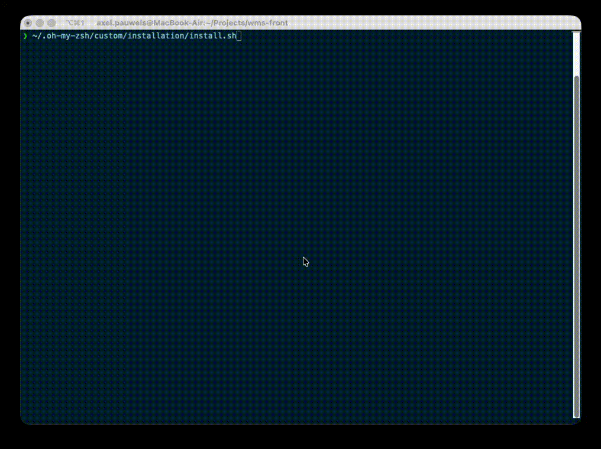
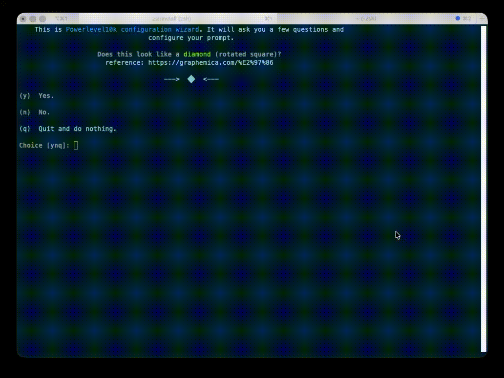

# About this wizard
When having a new Mac, it's always annoying to install all the tools and settings you want. This wizard will help you to install and configure your Mac with the tools you want.
Certainly as developer you want to have a nice terminal with zsh, ohmyzsh, powerlevel10k and some other tools. This wizard will help you to install these tools and configure them.
Besides the install Wizard, there is also an uninstall wizard available to remove all the installed tools and settings.

## Demo install wizard


## Demo powerlevel wizard


# Installation

Current version: **v2.2.0** (source of truth: [`VERSION`](./VERSION))

## Prerequisites
- A Unix-like operating system: macOS, Linux, BSD. 
- [Zsh](https://www.zsh.org) should be installed (v4.3.9 or more recent is fine but we prefer 5.0.8 and newer). If not pre-installed (run `zsh --version` to confirm), check the following wiki instructions here: [Installing ZSH](https://github.com/ohmyzsh/ohmyzsh/wiki/Installing-ZSH)
- `Xcode CLI tools` should be installed
- `git` should be installed (recommended v2.4.11 or higher)

## Getting started
Download the resources to specific hidden folder `~/.oh-my-zsh`:
```sh
# by https
git clone https://github.com/AxelPauwels/ohmyzsh.git ~/.oh-my-zsh

# by ssh key
git clone git@github.com:AxelPauwels/ohmyzsh.git ~/.oh-my-zsh

# by ssh key with domain (due to multiple ssh keys)
git clone git@github.com-AxelPauwels:AxelPauwels/ohmyzsh.git ~/.oh-my-zsh
```
Run one of these scripts:
```sh
~/.oh-my-zsh/custom/installation/install.sh
```
```sh
~/.oh-my-zsh/custom/installation/uninstall.sh
```

Once you installed `Zshrc file` you can run `zshInstall` or `zshUninstall` to run the install/uninstall script again.
Or you can add these as aliases yourself at your config.
```sh
alias zshInstall='~/.oh-my-zsh/custom/installation/install.sh'
alias zshUninstall='~/.oh-my-zsh/custom/installation/uninstall.sh'
```

### Install.sh
#### Zsh
_Just checks if zsh is installed. The installation of zsh is not developed yet_

#### Zshrc file
_Overrides ~/.zshrc file. (Note: Before overriding, there will be a backup file created of the existing `~/.zshrc` to `~/.zshrc.old`)_

#### Fonts
_Installs fonts to `~/Library/Fonts`. This will install `MesloLGS NF Regular` (recommended for powerlevelp10) and `Powerline` font-package._

_The powerline fonts-packages contains: 3270, Anonymice Powerline, Arimo for Powerline, Cousine for Powerline, DejaVu Sans Mono for Powerline, Droid Sans Mono for Powerline, Go Mono for Powerline, FuraMono-Regular Powerline, Go Mono for Powerline, Hack-Bold, Meslo LG for Powerline, MesloLGS NF, Monofur for Powerline, Noto Mono for Powerline, ProFont For Powerline, Roboto Mono for Powerline, Source Code Pro for Powerline, Space Mono for Powerline, SpaceMono-Bold, Symbol Neu for Powerline, Tinos for Powerline, Ubuntu Mono derivative Powerline,_

#### iTerm2
_Installs iTerm2 by `brew install --cask iterm2`. If brew is not installed, this will be installed before installing Warp._

#### iTerm2 color & font settings
_Sets the font to `MesloLGS NF Regular`, size to `13` (always use odd values here) and installs and sets our `Custom` color preset._

_These values can be found at iTerm2 > Settings > Profiles > Colors | Text_

#### Theme Powerlevel10k
_Installs the Powerlevel10k theme with configuration wizard. Warp does not support this yet. [See Warp-custom-prompt-compatibility](https://docs.warp.dev/features/prompt#custom-prompt-compatibility-table)_

#### Theme Agnoster

#### Warp
_Installs Warp by `brew install --cask warp`. If brew is not installed, this will be installed before installing Warp._

#### Warp Theme 'Custom'
_After installing this you should set some preferences._
_Warp > Settings > Appearance > Click on 'current theme' > Select at bottom 'Custom' > click check-icon_
_Warp > Settings > Features > Session > Honor user's custom prompt (PS1)_

#### Xtools

#### Homebrew

#### Pyenv

#### Mac Cursor speed

#### Mac Trackpad secondary click
_Choose between off, click with two fingers, click at bottom right corner or click at bottom left corner._

#### Mac Finder hidden files

#### GitHub Cli

#### Gitmoji Cli

#### Gitmoji Cli Hook
Install the gitmoji-cli hook in current dir, if current dir is a git repository.

#### Command 'tree'

### configure-powerlevel.sh
_Note: Currently not for Warp yet. (They are working on it)_

---

<p align="center"></p>

Oh My Zsh is an open source, community-driven framework for managing your [zsh](https://www.zsh.org/) configuration.

See ak
